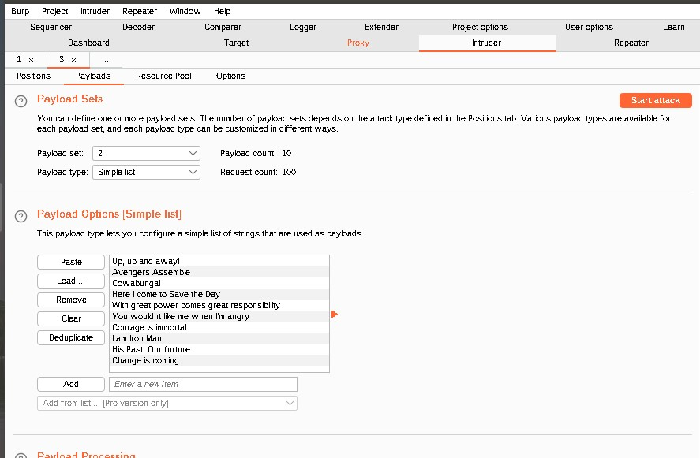

# Week-15-Homework

## Web Application 1: Your Wish is My Command Injection

- Command Injection for ping 8.8.8.8 && cat ../../../../../etc/passwd

- Command Injection for ping 8.8.8.8 && cat ../../../../../etc/hosts

### Mitigation Stratergies

- Avoiding command line calls if at all possible. Whenever possible use only APIs
- Reducing the number of users to access the database and the secure the locations of all the confidential files and the directories by restricting the permissions
- Creating a white list of possible inputs for the system to accept only the pre-approved inputs. If you use this method avoid using characters such as: ; & | 

## Web Application 2: A Brute Force to Be Reckoned With

- Burp Attack
  - 

- Payload Usernames Input
  - 

- Payload Password Input
  - 

- Succesful login
  - 
  
#### Mitigation Strategies

- Having a fixed number of failed attempts in order to lock the account
- More complex usernames and password, as well as increasing the frequency of changing the passwords
- Scan the logs to see if there was a brute force attempt with a brute force site

## Web Application 3: Where's the BeEF?

- Social Egineering >> Pretty Theft

- Social Engineering >> Fake Notification Bar

-
